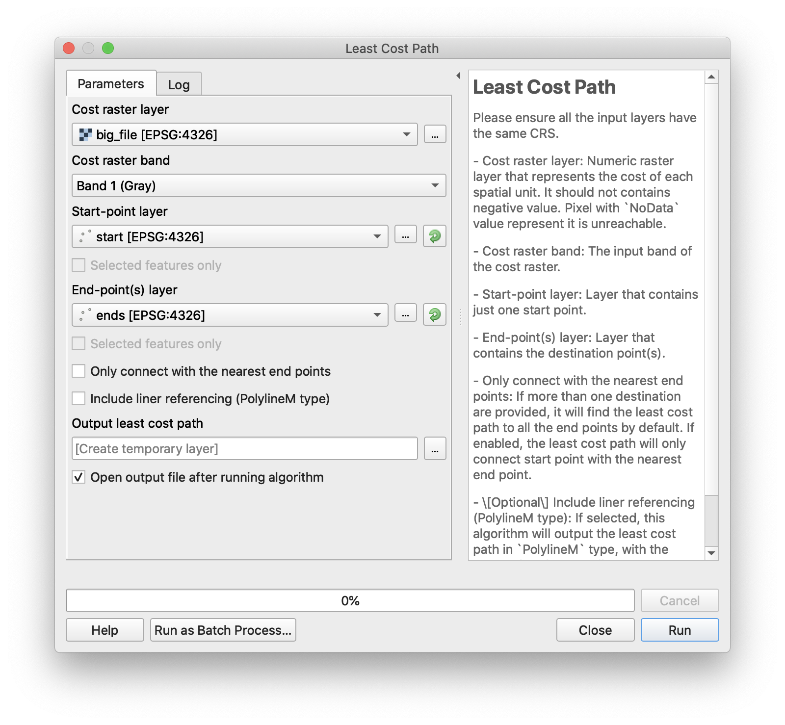
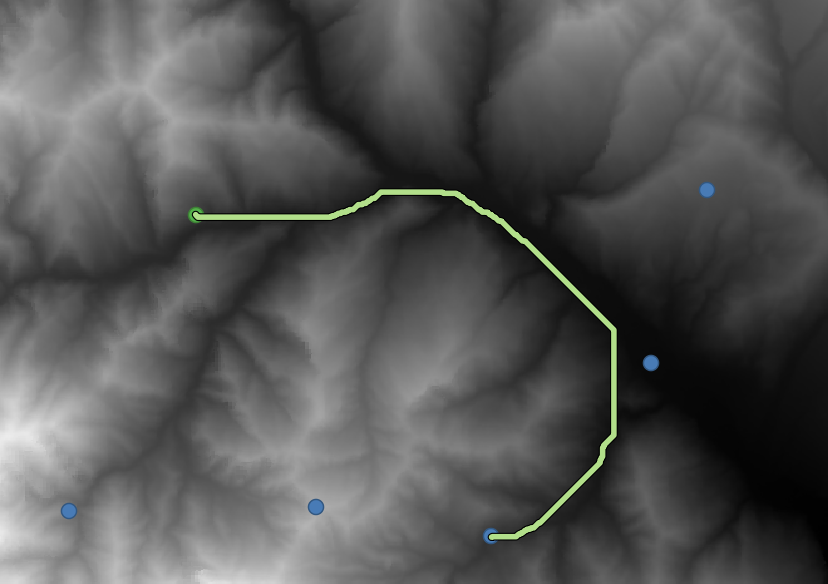

## The Least Cost Path Plugin for QGIS

This algorithm finds the least cost path with given cost raster and points. 

**Parameters:**
  
  Please ensure all the input layers have the same CRS.

 - Cost raster layer: Numeric raster layer that represents the cost of each spatial unit. It should not contains negative value. Pixel with `NoData` value represent it is unreachable.
 
 - Cost raster band: The input band of the cost raster.
 
 - Start-point layer: Layer that contains just one start point.
 
 - End-point(s) layer: Layer that contains the destination point(s). If more than one destination are provided, the least cost path will connect start point with the nearest one.
 
 - \[Optional\] Include liner referencing (PolylineM type): If selected, this algorithm will output the least cost path in `PolylineM` type, with the accumulated cost as linear referencing value.
 
 
**Contributors:**

JinxinGuo, XiaoyueXing, GezhiXiu, ShuoshuoShang, XuriGong
